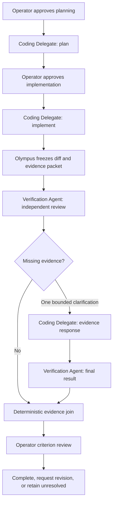

# Olympus — Agent Inventory Audit and Multi-Agent Architectural Direction

September 23, 2026, Phoenix. Audit and design recommendation only.

Historical snapshot: the subsequent operator instruction removed the Coding-pilot
prerequisite. Research @1 and Verification @1 have since been implemented in source;
see [RESEARCH-VERIFICATION-AGENTS.md](RESEARCH-VERIFICATION-AGENTS.md). The inventory
and zero-run observations below describe the pre-implementation audit. They do not
claim a completed pilot, and its Coding-first recommendation is no longer the plan.

## EXECUTIVE SUMMARY

**Olympus has one implemented executable delegated agent role: the Coding
Delegate, backed by the fixed Claude Code adapter.** It has a distinct invocation
path, tool/permission policy, isolated-worktree lifecycle, run/session identity,
approval gates and review evidence. Its identity is implicit in that handler and
role; there is no first-class versioned `AgentDefinition` registry today.

**There are zero verified completed delegated executions in the local database
inspected for this audit.** All seven inspected delegation/approval tables contain
zero rows. The configured executable exists and `--version` successfully reports
**2.1.222 (Claude Code)**. These facts establish implemented machinery and a
launchable binary, not authentication readiness, a successful paid pilot or a
completed task. No agent task was launched during this audit. [Runtime][delegate]
[launch][launch] [schema][schema]

Olympus is primarily an **orchestrator application**, with a conversational
reasoning surface. Its fixed workflows, skills, model routes, background cadence
and verification commands are not separate delegated agents. In particular,
Communication Intelligence's model-assisted assessment and Knowledge Audit's
parallel read branches do not increase the agent count.

The Agent Index contains **five candidates and two documented Codex roles**.
None is independently invokable through an Olympus executor. The actual Coding
Delegate is absent from the index. The two role notes say `status: active`, which
does not establish Olympus runtime availability. [Index][index] [General][general]
[Soldier][soldier]

The desired direction is adopted here as a planning constraint: **evolve toward
distinct, bounded, communicating agents, with versioned definitions and
operator-reviewed improvement**. The best next role is an independent
**Verification Agent**, provided it performs substantive evidence review rather
than merely wrapping the existing check runner. Establish the coding pilot and
its containment/evidence limits first. Do not build a generic framework now.

Audit scope: the current 0.18.0 worktree based on `cb25daf`, including the
uninstalled GPT-6 routing and Phase 1–2 CI v4 inspection changes; registered Rust
commands, process-launch sites, React delegation entry points, schema, relevant
planning/approval documents, all three files currently under `06 - Agents`,
installed delegate version/help, and read-only SQLite metadata. No private task
or source content was exported. No product code, vault note, authority, agent,
graph or UI was changed for this audit. Earlier test receipts are not presented
as fresh tests. [Inspection receipt][inspection]

## CURRENT AGENT INVENTORY

The classifications below describe what each concept is **today**. Workflow
runners are classified as orchestrator components because the supplied taxonomy
has no separate workflow category; they are not additional independent
orchestrators or agents.

| Concept | Classification | Runtime finding |
|---|---|---|
| Coding Delegate / coding-agent delegation / Claude Code pilot | **EXECUTABLE AGENT** | One role and one fixed driver adapter. Planning and implementation are stages of the same role, not two agents. |
| Olympus application | **ORCHESTRATOR** | Coordinates native commands, state, approvals, workflows and the delegate. No general autonomous fan-out engine. |
| Olympus chat / primary reasoning / Deep Analysis / comparison | **ORCHESTRATOR** surface | Context and model routing; no model-callable general tool dispatcher or delegation launch through chat. |
| Delegation coordinator, approval manager, completion review | **ORCHESTRATOR** components | Control-plane services around the Coding Delegate; cannot be counted as planning, approval or reviewer agents. |
| `communication-intelligence/v4` runner | **ORCHESTRATOR** component | Source-only new fixed five-node workflow. v3 assessment policy, corrected tracing; two actual skills. |
| `communication-situations/v1` runner | **ORCHESTRATOR** component | Fixed discovery/briefing/validation/publication path and optional cadence; not a Communications Agent. |
| `knowledge-audit/v1` runner | **ORCHESTRATOR** component | Fixed seven-node read/evidence graph with three concurrent code branches. No independent research/history/review agents. |
| Gmail sync, refresh cadence, project scan, source-health and UI navigation | **ORCHESTRATOR** infrastructure | Deterministic services, timers and projections. Autonomy of a timer does not create an agent identity. |
| `communication-assess@2` | **SKILL** | Compiled reusable assessment contract; model reasoning and bounded cached expansion remain runner-controlled. |
| `project-relevance@2` | **SKILL** | Compiled pure bounded name/alias matcher; no model or independent retrieval. |
| `situation-discovery@1`, `situation-briefing@1` | **SKILL**, workflow-local contract status | Purpose-specific model capabilities used by the Situation runner. They are string-labelled contracts in that workflow, not full entries in the two-skill registry. |
| Situation reply drafting, research retrieval, source verification, synthesis/recommendation helpers | **SKILL**, capability/helper status | Reusable or workflow-local functions, not independent agents and not all formal `SkillContract` records. The fixed delegation check runner is a tool in this category, not a Verification Agent. |
| PRIMARY `gpt-6-sol` / medium | **MODEL** | Current source configuration; the prior installed route must not be inferred from this uninstalled edit. |
| DEEP_REASONING `gpt-6-astra` / high | **MODEL** | Explicit reasoning route, not an Astra Agent. |
| `claude-opus-5` comparison | **MODEL** | Conversational comparison, distinct from delegated execution. |
| Coding route `sonnet` | **MODEL** | Alias supplied to Claude Code, not a confirmed serving snapshot or an additional agent. |
| `gpt-realtime-2.1`, `gpt-4o-mini-transcribe` | **MODEL** | Audio rendering/transcription infrastructure; no independent speaker/listener agents. |
| Research Analyst | **DOCUMENTED / CANDIDATE AGENT** | Index description only; no distinct registered executor. |
| Project Architect | **DOCUMENTED / CANDIDATE AGENT** | Index description only. Coding planning is related work, not this separately identified agent. |
| Daily Briefing Officer | **DOCUMENTED / CANDIDATE AGENT** | No executor for this role. Existing background Situation updates are not that agent. |
| Obsidian Curator | **DOCUMENTED / CANDIDATE AGENT** | Vault utilities and external Codex skills do not implement this role. |
| Codebase Navigator | **DOCUMENTED / CANDIDATE AGENT** | Repository reading exists inside the delegate; there is no separate Navigator invocation/lifecycle. |
| Strategy General | **DOCUMENTED / CANDIDATE AGENT** | Human/Codex Layer 1 operating role, no Olympus adapter or run identity. |
| Project Soldier | **DOCUMENTED / CANDIDATE AGENT** | Human/Codex Layer 2 operating role, no separately registered Olympus executor. |
| Research / Verification / Communication / Project State / Knowledge Audit Agents in future designs | **DOCUMENTED / CANDIDATE AGENT** | Design targets, including this request; no current executor identities. |
| Codex or other alternate delegation drivers mentioned in the pilot document | **DOCUMENTED / CANDIDATE AGENT** integration | No implemented selectable alternate adapter. External Codex sessions, including this audit, are outside Olympus's runtime inventory. |
| CI v1/v2 paths, v3 saved definitions; old triage/summary/recommendation node concepts | **LEGACY / UNUSED** as current agent candidates | Historical records and compatibility/test/helper code, not current agent executors. Historical data remains valid evidence under its original semantics. |

Evidence: [registered command modules][modules], [native registrations][native],
[delegation service][service], [workflow types][workflow], [CI runner][ci],
[Situation runner][situations], [audit runner][audit], [skills][skills],
[model constants][models], [voice][voice], [vault roles][index]. A folder category
named Agent, a seed project named Agentic AI Scaffolder, or a `skill_recipes` row
is metadata, not an execution path. [Constellation classification][constellation]

## EXECUTABLE AGENTS

### Coding Delegate — one code-defined executor role

| Required property | Verified current implementation |
|---|---|
| Stable identity/name | Product UI says Coding agent; implementation is the fixed coding delegation handler. No stored canonical `agentId`. `coding-delegate` would be a proposed future ID, not an existing database fact. |
| Handler | `delegation.rs`: prepare/start/resume/cancel/list/diff; `spawn_claude` launches the driver; `monitor_child` observes it. |
| Driver | Backend-owned `%APPDATA%/npm/node_modules/@anthropic-ai/claude-code/bin/claude.exe`; version is checked during proposal preparation. Installed check returned 2.1.222. Driver version is recorded in proposal/run data. |
| Configured model | `models::CODING_MODEL = "sonnet"`. The adapter stores the requested alias, not confirmed actual model/token usage from the CLI result. |
| Role | Plan and implement one operator-reviewed project task; preserve a reviewable result in an isolated Git worktree. |
| Inputs | Project ID resolved under configured projects root; 1–4,000-character task; 1–8 criteria of at most 400 characters; clean repository/base; approved plan for implementation; preserved session on implementation resume. |
| Sources | Intended repository/worktree and supplied task/criteria/plan. This is not an OS-level filesystem sandbox; the adapter does not mediate each CLI file read. Repository instructions and CLI settings need a separate containment review before stronger claims. |
| Planning tools | Fixed `--tools Read,Glob,Grep`, `--permission-mode plan`. No editing grant in this stage. |
| Implementation tools | `Read,Glob,Grep,Edit,Write` and allowed Bash prefixes for `git status`, `git diff`, `npm run build`, `npm test`, `cargo test`, `cargo check`; `--permission-mode dontAsk`. |
| Write/effect authority | Implementation may modify the isolated worktree after separate approval and run the permitted local checks. Policy forbids commit, push, merge, deploy, deleting human work, task expansion and product-direction changes. Olympus itself creates the worktree/branch and records operational evidence. |
| Approval | Dedicated native UI proposal; backend-owned exact subject; ten-minute expiry; current desktop session; one-use consumption before launch; separate planning and implementation approvals. Failed preparation consumes its approval and needs fresh review. |
| Workflows invoking it | The dedicated Project delegation state machine/UI. No `GraphNode` currently invokes this agent, and chat does not launch it. |
| Run/evidence identities | `delegation_runs.id`, project/base/branch/workspace, `agent_session_id`, process ID; `delegation_events`; `delegation_contracts`; `operator_approvals`, consumptions/revocations; `delegation_checks`; `delegation_reviews`. |
| Observable lifecycle | Preparing, planning, waiting, editing, testing, reviewing, awaiting_review, complete, failed, cancelled. Some phase labels are inferred from observed tool names/command words and are monotonic progress labels, not measured node attempts. |
| Availability | Implemented and registered; configured binary exists and version probe succeeds. No live authentication, quota, target-project readiness or full pilot was established. |
| Version | No formal Agent definition version. Existing scope strings are `plan-v1` / `implement-v1`; driver version/model and exact approved subject are recorded. These are useful boundaries, not a complete immutable AgentDefinition snapshot. |
| Last verified execution | No delegated execution receipt found in the inspected operational database: all delegation and approval counts were zero. Historical docs also describe paid pilot acceptance as outstanding. No last-success date can be assigned. |
| Failure | Process errors, absent/error/oversized result records and preparation failures fail the run. Successful planning saves a plan and waits; successful implementation ends at awaiting_review. Neither result proves completion. |
| Recovery | Listing runs detects in-memory-untracked active phases, probes a stored PID and changes them to waiting; a live detached process must be cancelled before resume. Resume rechecks base, repository/worktree membership and fingerprint with fresh approval. Failed/cancelled terminal runs do not have a direct resume path; preserve them and prepare fresh work. |
| Cancellation | Revokes pending/recorded scope, signals the running process monitor or handles a detached PID; Windows `taskkill /T /F`, fallback child kill; worktree preserved. The UI distinguishes unverified child termination. Cancellation does not undo effects already performed. |
| Invoke other agents? | No Olympus sub-delegation API/tool is provided to it. External CLI-internal features/settings are not a verified Olympus agent graph and must not be counted as peers. |
| Invoked by other agents? | No current agent-to-agent entry contract. The operator invokes the native approval flow; Olympus launches it. |
| Peer communication? | None implemented: no typed peer inbox, correlation, handoff, shared graph ownership or supported peer endpoint. |

[Definition/input handling][delegate] [launch/tool arguments][launch]
[monitor/recovery][monitor] [proposal and resume checks][proposal]
[approval semantics][approvals] [completion checks][review] [UI][delegate-ui]

Three qualifications materially affect future design:

1. **Budget is per launch.** `--max-budget-usd 5` is added by every
   `spawn_claude` call. There is no Olympus aggregate spend ledger spanning plan,
   implementation and recovery launches. The documentation's “$5 run ceiling”
   overstates what this code establishes. The coding monitor has no wall-clock
   timeout or Olympus-owned iteration cap. The separate verification-command
   runner does enforce a 600-second timeout. [Launch][launch] [monitor][monitor]
   [check runner][checks]
2. **Tool permissions are not complete containment.** Planning explicitly
   selects available tools. Implementation supplies `--allowedTools`, without
   an equivalent explicit `--tools` inventory or pinned settings/MCP configuration.
   Installed CLI help distinguishes those flags. This is an uncertainty requiring
   validation, not proof that any forbidden tool actually ran. Working directory,
   permissions and prompt prohibitions do not create a filesystem/network jail.
   Allowed npm/Cargo checks execute repository-controlled code; they can have
   effects beyond reading files. The check runner also inherits its process
   environment rather than the delegate's filtered environment. [Launch][launch]
   [check runner][checks]
3. **Evidence is useful but coarse.** Progress events retain phase/milestone;
   terminal failure/cancel/success updates are not all append-only events.
   CLI results are reduced to text/error, not structured model/usage receipts.
   Recovery checks a PID's presence, not a recorded process-start identity.
   A new catalog must describe these coverage limits instead of borrowing CI v4
   timing/provenance semantics. [Progress parser][progress] [schema][schema]

## ORCHESTRATORS

Olympus's orchestration resides in Rust commands, fixed runners, approval state
and operator-facing React controls. The conversational model receives selected
context and produces answers/proposals. OpenAI request payloads have no tools;
the Anthropic conversational request has no tool definition field. Voice permits
a closed set of navigation proposals, not execution approvals. The backend's
own running-build text explicitly says chat cannot launch delegation.
[Assistant][assistant] [Responses][responses] [voice][voice]

There is real coordination already: clean-worktree creation, separate approval
stages, monitored processes, bounded cached-evidence expansion, deterministic
joins, source guards and human completion review. Knowledge Audit actually runs
three scoped Rust threads for research/history/reviews, but those branches have
no distinct agent contract or invocation identity. Parallel functions are not
peer agents. [Audit branches][audit-branches]

The current graph type has only `id`, `kind`, `dependsOn`, `maxIterations`.
It describes fixed backend workflows; it does not provide scheduling, agent
dispatch, authorization, peer transport or arbitrary runtime execution.
[Workflow types][workflow]

## SKILLS MISLABELED AS AGENTS

No active compiled skill registry entry claims to be an Agent. Preserve that
correct distinction. `communication-assess@2` remains a Skill even though it
uses a model and requests cached expansion. `project-relevance@2` remains a
Skill even though it contributes to both assessment context and final results.
Their callers own selection, lifecycle and effects. [Registry][skills]
[CI inspection][inspection]

Situation discovery/briefing, deterministic research retrieval, recommendation
synthesis and check execution would be misleadingly renamed “agents” without
independent contracts/lifecycles. Knowledge Audit's research and verify nodes
are particularly plausible sources of confusion; neither is an agent today.
The five Agent Index candidates describe useful work, but existing helpers
that partially perform that work are not proof those named roles exist.

## MODELS MISLABELED AS AGENTS

The compiled routes are correctly model/capability infrastructure. Sol, Astra,
Claude comparison, Realtime and transcription are not separate agents.
“Claude Code” identifies the current Coding Delegate's driver, while `sonnet`
identifies its requested model alias. Do not turn that implementation detail
into the permanent role identity. A future second driver implementing the same
coding contract would not automatically be a second role. [Models][models]

The Codex roles in the vault describe how a person uses external Codex workspaces;
they are not executable Codex-backed Olympus adapters. This audit's tools and
host-provided multi-agent capabilities likewise do not belong to Olympus.

## DOCUMENTED / CANDIDATE AGENTS

The index currently has five prose entries: Research Analyst, Project Architect,
Daily Briefing Officer, Obsidian Curator and Codebase Navigator. None has an
independent implementation record, native invocation or own lifecycle.

Its two linked notes, Strategy General and Project Soldier, are present and
marked active. Their missions define strategy/memory and focused project work,
respectively. They have no handler, tool manifest, approval binding or executable
version. Classify them as **documented external operating roles**, keeping their
authored status separate from runtime availability. The scaffolding scripts
create these notes; they do not register executors. [Index][index]
[General][general] [Soldier][soldier] [role scaffolding][role-script]

Research, Verification, Communication, Project State and Knowledge Audit agents
in this architectural direction are prospective roles. No UI should mark them
executable until their distinct invocation, authority and evidence paths exist.

## AGENT INDEX ACCURACY

| Difference | Assessment / smallest correction to propose |
|---|---|
| Coding Delegate missing | Add a runtime-linked entry identifying role, fixed adapter, prerequisites and unverified live pilot. Do not claim successful execution. |
| Five candidates | Their Candidate heading is accurate. Retain it; do not promote based on helper functions or model routes. |
| Two active Codex notes | Authored active role status is ambiguous alongside runtime availability. Add an explicit “external documented role; no Olympus executor” distinction. |
| Possible duplicate identities | No exact duplicate named agent entries found. There is semantic overlap: Strategy General with Olympus, Project Soldier with coding delegation, Project Architect/Codebase Navigator with its plan/read phase. Do not silently merge or count these overlaps as executors. |
| Delegation documentation | Mentions selectable/alternate drivers, though the actual request selects only a proposal ID and the adapter is fixed. Also names 2.1.220 versus the observed 2.1.222. |
| Capability/approval wording | Candidate rule “vault writes after approval” is insufficient as an executable policy. Coding additionally requires exact stage/task/workspace consent and evidence-based completion. |
| Runtime evidence absent from index | Process recovery, cancellation, one-use approval, criterion review and the absence of successful runs are not represented. |
| Index in stable prompt | `vault_context.rs` loads Agent Index with durable notes. It is context, not a registry. Explicitly label candidate/documented authority and provide separate compiled availability in a future prompt/catalog pass. |
| Existing prompt drift | The same loader calls the compiled skills “v1” and “Manual local” despite current v2 model-assisted assessment. Record this as an accuracy issue to fix separately; it does not create an Agent. |

[Index][index] [context loader][context] [pilot document][pilot-doc]
[current input contract][service]

This task did not rewrite the operator-owned index or role notes. A future
read-only catalog should compare them to compiled registrations rather than
treat Markdown or frontmatter as executable registration.

## CURRENT MULTI-AGENT CAPABILITY

**Present:** one executor role, potentially multiple run instances across
different projects; a per-project active-run restriction; a process map keyed
by run ID; serialized preparation/launch/cancel transitions rather than a global
one-process lifetime lock. Independent workflows also run code concurrently.
Those implementation properties do not prove a multi-role collaboration has
executed. [Process map and active-run guard][delegate] [approval lock][approvals]

**Absent:** a closed executable-agent catalog, agent definition snapshots,
agent-aware graph nodes, child-run ownership, agent-to-agent messages, peer
selection, typed handoff/result correlation, graph-wide budgets/cancellation,
independent agent evaluations and an approved improvement/adoption mechanism.
There is no supported path for a delegate to authorize or dispatch another agent.

The honest description is **an orchestrator with one delegated executor and
several fixed workflows**, not a functioning peer-agent team.

## FUTURE AGENT CONTRACT

Start with a compiled, immutable descriptor beside the existing delegate, not
a runtime-loaded plugin, persona document or universal executor framework.

| Field group | Minimum purpose |
|---|---|
| Identity | Stable role ID, definition version, human name/purpose, definition hash and adapter/version reference. |
| Invocation | Closed backend handler key; input/output schema versions; permitted initiating workflows; required completion evidence. |
| Composition | Exact skill ID/version references and direct tool profiles. Existing coding tools must be described honestly before any formal skills are extracted. |
| Authority | Source scopes, reads, proposals, approval-required writes/execution, verify capability and prohibited effects. References to existing approval mechanisms, not a new approval boolean. |
| Limits | Invocation/iteration counts, deadline, source/output bounds, cumulative usage budget where measurable, stop/escalation rules and allowed retry policy. |
| Communication | Allowed message schemas, recipient roles, permitted graph edges and maximum rounds. No arbitrary addresses or dynamic peers. |
| Runtime policy | Configured model strategy/route version, cancellation/recovery behavior, isolation requirements and availability probe. |
| Evidence | Required trace/receipt versions, artifact provenance, evaluation contract and retention rules. |

Separate **definition**, **availability observation**, and **run instance**.
Each run pins the actual definition snapshot/hash, adapter, model configuration,
source scope and authorization references, plus parent graph/node/run if any.
Record actual model from response metadata when available; never manufacture it
from an alias. Do not retroactively populate old runs with today's descriptor.

Material changes to capabilities, communication, authority, sources, strategy,
loops, routing or verification requirements require a new definition version or
explicit equivalent contract boundary. A compatible model replacement can leave
the role ID stable, but must still pin a reviewed configuration/route revision
per run. A changed model *strategy* can require a new agent contract version.

Agents may compose skills; they do not privately redefine them. Grant the
intersection of the agent contract, skill requirement and run authorization.
A Skill declaration alone cannot grant tools. Independent skill invocation by
Olympus and agent-free deterministic graphs remain supported concepts.

## AGENT COMMUNICATION

Use a small Rust-owned broker **when the first two-role workflow needs it**.
Define typed packets, not an open chat room. Suggested envelope:

```text
messageId, schemaVersion, messageType
senderAgentId + definitionVersion + senderRunId
recipientAgentId + definitionVersion + recipientRunId
graphId + graphVersion + graphRunId + edgeId
correlationId, replyTo, sequence, idempotencyKey
purpose, requestedAction, expectedReplySchema
evidenceRefs + artifactHashes + source/account scopes
authorizationRef, createdAt, deadline
typedPayload
```

Initial message types: `TaskRequest`, `EvidencePacket`, `ResultPacket`,
`ClarificationRequest`, `ClarificationResponse`, `VerificationChallenge`,
`VerificationResult`, `Escalation`, `CancelRequest`, `CancelAcknowledgement`.
Do not implement every type before a consumer exists. Joins belong to the graph's
control logic; they consume typed results, not model claims of consensus.

The broker supplies authenticated sender/run identity rather than trusting it
from prose. It validates an active graph edge, recipient availability, schemas,
data scope, payload size, deadlines and remaining budget; records delivery and
outcome; and handles duplicate or late replies without repeating side effects.
Parent run owns child execution and cancellation. Retried work gets an explicit
attempt identity under an approved retry rule, not a replayed write permission.

**A handoff transfers a task/evidence reference, never operator consent.** The
existing approval subject binds run, project, stage, plan and workspace. Another
agent cannot reuse that approval for a new child run or broaden the task. Any
future delegated grant requires a validated explicit scope mechanism; until
then, use the existing operator review for each approval-required effect.

Persist sender, receiver, message type, requested action, evidence references,
timestamps, structured response and outcome. Show concise supporting rationale
and externally observable evidence, not hidden chain-of-thought. Treat source
content and other agents' outputs as untrusted data; a packet cannot change its
recipient's authority or instructions.

## MULTI-AGENT GRAPHS

Keep the fixed runner approach for the first collaboration. A future compiled
node may bind an exact agent definition and create an independently identified
child run. Other nodes remain deterministic code or direct skill invocations.
Do not change current `kind` strings into executable DSL instructions.

The parent runner should own dependencies, dispatch, input validation, budgets,
approval checkpoints, cancellation propagation, failure policy and deterministic
join validation. Parallel branches need independent source/workspace boundaries;
do not let two agents concurrently modify the same worktree. Joins must reject
stale artifact hashes, wrong correlation IDs and unsupported verification claims.

Routing selects only compiled available roles via an explicit graph edge,
operator selection or a bounded classifier whose output is validated against
that closed set. No generated agent names, arbitrary executables, runtime role
creation or self-appointed peers. Model routing remains a separate decision.

CI v4 inspection offers useful snapshot/trace discipline, but it is not an agent
runtime. Knowledge Audit's fixed fan-out/join offers a coordination example,
not an existing multi-agent abstraction. Extend only for a demonstrated second
consumer, preserving each workflow's evidence/completion semantics.

## BOUNDED AGENT LOOPS

Agent loops are warranted when observations determine the next useful permitted
capability. Fixed scans/matching should stay deterministic. Every future loop
must bind an explicit iteration/request limit, allowed skills/tools/sources,
deadline, usage/output budget, output schema, success/insufficiency stop rules,
escalation, approval and recovery policy.

Enforce budgets across child agents and retries at the parent, reserving capacity
before dispatch. A loop budget counts the defined action, not an ambiguous mix
of model tokens, thread expansions and peer messages. Record separate counters.
Stop on no new evidence, exhausted budget, stale sources, cancellation, unresolved
authorization or persistent disagreement. “Keep trying until solved” is not a
permitted policy.

For the initial coding/verification pilot, start with **one review pass and at
most one evidence-clarification round**, no autonomous implementation retry.
Disagreement or a requested code change returns to operator review. A later
version can authorize a precisely bounded repair cycle after pilot evidence
justifies it. Set actual time/usage caps in the reviewed contract before launch;
do not advertise inherited per-process limits as graph-wide enforcement.

## SELF-IMPROVEMENT PATH

Preserve the requested lifecycle:

`run → evidence → evaluation → proposed revision → tests → comparison → operator review → versioned adoption`

A revision proposal should identify the failure cohort and evidence, affected
agent/skill/graph/route versions, exact change, authority delta, expected benefit,
test plan, comparison conditions and rollback target. Test in fixtures and
isolated approved trials; operator adoption creates a new version and retains
the predecessor. Never edit a running definition or relabel historical results.

Start with factual counts and denominators: eligible runs, verified criterion
completion, process/schema failure, operator correction/acceptance, latency,
known usage, iteration/clarification counts, escalation, failed handoffs,
disagreement and verification failure. Keep unknown usage unknown. Split process
success, model assertions, deterministic checks and operator acceptance. Cohort
comparisons must state definition/model/data differences and sample size; a
small sample is not evidence of general superiority.

Improvement proposals are outputs, not grants. They cannot silently rewrite
definitions, widen source access, approve execution, change standing policy or
deploy themselves. No composite “agent intelligence” score is needed.

## SECOND AGENT RECOMMENDATION

**Recommend a bounded Verification Agent**, after the existing coding delegate
passes its real approval/cancellation/recovery/criterion-review pilot.

| Candidate | Independent value and collaboration | Main drawback | Recommendation |
|---|---|---|---|
| Verification | Separate responsibility for challenging whether a frozen diff/artifact satisfies the approved criteria; reusable across coding and later improvement proposals; naturally consumes coding evidence and produces attributable challenges. | Must do independent evidence reasoning, not rename `run_delegation_check`; test execution can have effects, and model review cannot replace operator approval. | Best second role. |
| Research | Distinct source discovery and evidence synthesis can support planning and verification. | Current research is bounded local lexical retrieval; new web/source access, provenance and authorization are a larger boundary expansion. | Strong later role once a concrete discovery task demands it. |
| Communication | Could reconcile ambiguous conversations across contexts. | Existing assessment skills and fixed Situation runner already provide much of this value; separation risks renaming model calls. | Wait for distinct authority/lifecycle need. |
| Project State | Could reconcile Git, vault intent and operational evidence. | Much work is deterministic projection; changing commitments remains operator-owned. | Prefer a workflow plus reusable skills initially. |
| Knowledge Audit | Existing evidence graph has useful bounded inputs, joins and verification. | Its current job is deterministic; a wrapper adds identity without capability. | Keep as workflow until an independent review/discovery role emerges. |

The Verification Agent should accept a frozen base/head/workspace fingerprint,
approved task/criteria, bounded diff/artifact set and recorded check evidence.
It can inspect within that scope, identify unsupported assertions, request a
specific missing evidence packet, and return criterion-level
`supported / contradicted / insufficient` findings with references. It cannot
edit production code, mark the coding run complete, approve a fix, merge or deploy.

Initially, additional checks can be requested through the existing operator/check
service rather than giving the reviewer a generic shell. If autonomous check
selection becomes necessary, use a closed, approved check profile in an isolated
environment. Independence comes from its role, contract, run identity and review
evidence, not from choosing a different model. A model may power the review;
the observed artifact and checks remain the basis of its claim.

## FIRST MULTI-AGENT WORKFLOW

Choose **approved code change → independent criterion verification → operator
completion review**. This adds a useful challenge boundary directly to the one
real delegate instead of inventing an unrelated demonstration team.



This is a **future design**, not implemented execution. The clarification stage
gets an explicit read/evidence-only contract; it must not reuse the coding
implementation grant. Code changes or new effects require the appropriate new
proposal. No completion action is available to either agent. Exact criterion
matching and current-workspace checks remain in `complete_delegation_review`.

Separate agents are justified when the reviewer can independently question the
implementer's claims and has a distinct evidence-only authority boundary. If
the task only needs `cargo test`, one agent plus the existing check tool is
simpler and should remain the chosen design. Do not require multi-agent handling
for every change.

## AGENT CATALOG

The smallest future catalog is read-only and secondary to existing Project
delegation/inspection surfaces. No new top-level System section is necessary.

**EXECUTABLE NOW:** one Coding Delegate card, labelled “implemented; binary
probe passed; live pilot unverified.” Display role, adapter/version, configured
model versus actual-model coverage, tools, source/effect limits, approval flow,
invoking workflow, run history and last verified execution (currently none in
the inspected database). A disabled/missing prerequisite must not be hidden
behind the word available.

**ORCHESTRATORS:** Olympus and its fixed coordination mechanisms, clearly
separate from executor roles. Existing Graph/Skill Details remain their own
concepts.

**DOCUMENTED / CANDIDATE:** the five index candidates and two external Codex
roles, with source-note link, authored status and explicit runtime status. No
Run button based on Markdown. Display conceptual overlap without merging IDs.

Data sources should be compiled descriptors for runtime truth, read-only
availability observations, original run records and separately labelled vault
descriptions. Do not use `list_delegation_runs` as a supposedly pure catalog
read: it currently performs recovery writes. Introduce a genuinely read-only
projection if that view is built. Preserve the existing recovery behavior in
its proper control-plane location. [Recovery listing][recovery]

Do not render an agent relationship map yet. A one-role map adds little. Once
real agent edges exist, show only actual compiled invocation relationships and
recorded communication, distinguishing permitted edges from executed edges.
Candidate ideas can remain a separate list. Message inspection should expose
sender/recipient/version/run, type, evidence, timestamp, requested action,
response and outcome; never hidden reasoning.

## PHASED ROADMAP

| Step | Smallest warranted work | Exit evidence |
|---|---|---|
| A — Truth and definition proposal | Keep this audit; reconcile proposed index/runtime labels; draft a compiled Coding Delegate descriptor and availability semantics. Preserve current Skills/Graphs inspection. | Every executable card traces to a registered handler; no candidate has executable status; historical gaps remain explicit. |
| B — Prove and bound the first role | Run the separately approved native coding pilot; verify installed driver permissions/settings, source/effect containment, per-launch versus cumulative budget, deadline, cancellation and process identity; snapshot future definitions without rewriting old records. | Approved task → plan checkpoint → approved edit → real checks → operator completion; tested failure/restart/cancel; evidence for the claimed boundary. |
| C — Useful independent reviewer | Implement a narrow Verification Agent only after a concrete review fixture demonstrates value over one agent plus checks. Give it a separate run/definition and evidence-only authority. | It finds seeded unsupported claims, preserves uncertainty, cites exact artifacts and cannot edit/approve/complete work. |
| D — One agent-aware fixed graph | Bind coding and verification roles to a compiled workflow; parent/child run links, source hashes, budgets, deterministic join and cancellation. | Wrong/stale results rejected; one branch failure cannot become workflow success; no concurrent mutation of a shared worktree. |
| E — Minimum typed collaboration | Add only the evidence/result/clarification messages required by that graph, with scope, correlation, idempotency, deadlines and bounded rounds. | Duplicate, late, wrong-recipient, wrong-account, expired-authority and prompt-injected packets fail safely; cancellations settle child ownership. |
| F — Evaluate collaboration | Compare against the single-agent/check baseline on comparable tasks; record completion evidence, extra cost/time, disagreement and operator burden. | Demonstrated benefit with visible denominators and failure cases; remove coordination that adds no value. |
| G — Versioned improvement proposals | Produce reviewed, tested contract/skill/graph/route changes from attributable run evidence, with rollback and cohort separation. | No proposal authorizes itself; old definitions/results stay bound; adoption is explicit and reversible. |

This sequence is intentionally conditioned on evidence, not a promise to build
every stage. It does not cancel the approved Home semantic-navigation pilot;
that remains an independent UI slice. Neither this audit nor a future graph
approval authorizes a particular coding task or broadened agent authority.

## DEFER

- Generic agent framework, dynamic agent creation, arbitrary executors or runtime plugins.
- One agent per node/skill/model, persona teams and ornamental relationship maps.
- Unrestricted peer chat, arbitrary peer networks and unbounded repair/debate loops.
- Workflow authoring, graph DSL/execution engine and general scheduler.
- Marketplace, system-wide capability map and new permanent top-level navigation.
- Autonomous scope expansion, self-approval, automatic merge/push/deploy or silent adoption.
- Global agent scores, inferred completion, invented token attribution or retroactive historical contracts.
- Agent-specific memory authority and standing-policy updates without a separate reviewed design.
- Building the proposed second agent, catalog or communication transport in this audit.

## RISKS

| Risk | Required response |
|---|---|
| Capability inflation from names/Markdown | Separate compiled availability, documented role and actual execution evidence. |
| Mistaking a handler for a live-proven agent | Show zero live receipts honestly; validate one native pilot before adding peers. |
| CLI permissions overstated as containment | Verify installed flag behavior/settings/hooks/MCP and repository-command effects; enforce real source/process/network boundaries before claiming them. |
| Per-launch budgets become unbounded coordination spend | Add parent-owned cumulative accounting, deadlines and bounded retries/rounds. |
| Peer packet launders operator authority | Validate exact scope through existing approval machinery; messages carry evidence, not consent. |
| Stale or shared-worktree verification | Freeze artifacts, bind checks/results to hashes, avoid concurrent writes and revalidate at join/review. |
| Reviewer becomes rubber stamp or new authority | Independent criterion evidence, explicit uncertainty and operator-owned completion. |
| Documentation/UI claims outrun tracing | Keep coverage indicators; agent milestones are not CI node timing, and requested aliases are not serving-model receipts. |
| Cancellation/recovery targets wrong or lingering process | Strengthen process identity/ownership; retain uncertainty when descendant termination cannot be verified. |
| Coordination adds cost without value | Compare against one agent plus skills/checks before expanding. |
| “Self-improvement” silently rewrites permissions | Versioned proposals, fixture tests, controlled comparisons, operator adoption and rollback. |
| Agent Index biases authoritative prompt context | Label documentary/candidate material; compiled mechanism facts establish runtime availability, not prose. |

The architecture should leave room for genuine multi-agent collaboration by
making identity, evidence, authority and invocation boundaries explicit. It
should earn the next agent through a useful independent responsibility, not by
renaming the workflows that already exist.

## EVIDENCE REFERENCES

Line links refer to the audited worktree. CLI probes were `--version` and
filtered `--help` only; no model inference. SQLite was opened with
`DatabaseSync(..., {readOnly: true})`; inspected counts for `delegation_runs`,
`delegation_events`, `delegation_contracts`, `delegation_checks`,
`delegation_reviews`, `operator_approvals`, `approval_consumptions` were all zero.
No conclusion about other databases or unrecorded external sessions is implied.

[delegate]: <C:/Users/kevpe/OneDrive/Documents/New project/Olympus Memory Worktree/src-tauri/src/commands/delegation.rs:26>
[launch]: <C:/Users/kevpe/OneDrive/Documents/New project/Olympus Memory Worktree/src-tauri/src/commands/delegation.rs:504>
[monitor]: <C:/Users/kevpe/OneDrive/Documents/New project/Olympus Memory Worktree/src-tauri/src/commands/delegation.rs:707>
[progress]: <C:/Users/kevpe/OneDrive/Documents/New project/Olympus Memory Worktree/src-tauri/src/commands/delegation.rs:357>
[proposal]: <C:/Users/kevpe/OneDrive/Documents/New project/Olympus Memory Worktree/src-tauri/src/commands/delegation.rs:978>
[recovery]: <C:/Users/kevpe/OneDrive/Documents/New project/Olympus Memory Worktree/src-tauri/src/commands/delegation.rs:1285>
[approvals]: <C:/Users/kevpe/OneDrive/Documents/New project/Olympus Memory Worktree/src-tauri/src/commands/approvals.rs:11>
[review]: <C:/Users/kevpe/OneDrive/Documents/New project/Olympus Memory Worktree/src-tauri/src/commands/delegation_review.rs:281>
[checks]: <C:/Users/kevpe/OneDrive/Documents/New project/Olympus Memory Worktree/src-tauri/src/commands/delegation_review.rs:88>
[schema]: <C:/Users/kevpe/OneDrive/Documents/New project/Olympus Memory Worktree/src-tauri/schema.sql:47>
[delegate-ui]: <C:/Users/kevpe/OneDrive/Documents/New project/Olympus Memory Worktree/src/components/panels/DelegationPanel.tsx:71>
[service]: <C:/Users/kevpe/OneDrive/Documents/New project/Olympus Memory Worktree/src/services/delegation.ts:58>
[modules]: <C:/Users/kevpe/OneDrive/Documents/New project/Olympus Memory Worktree/src-tauri/src/commands/mod.rs:1>
[native]: <C:/Users/kevpe/OneDrive/Documents/New project/Olympus Memory Worktree/src-tauri/src/lib.rs:330>
[workflow]: <C:/Users/kevpe/OneDrive/Documents/New project/Olympus Memory Worktree/src-tauri/src/commands/workflow.rs:1>
[ci]: <C:/Users/kevpe/OneDrive/Documents/New project/Olympus Memory Worktree/src-tauri/src/commands/gmail/intelligence_v3.rs:1>
[situations]: <C:/Users/kevpe/OneDrive/Documents/New project/Olympus Memory Worktree/src-tauri/src/commands/gmail/situations/engine.rs:158>
[audit]: <C:/Users/kevpe/OneDrive/Documents/New project/Olympus Memory Worktree/src-tauri/src/commands/knowledge_audit.rs:14>
[audit-branches]: <C:/Users/kevpe/OneDrive/Documents/New project/Olympus Memory Worktree/src-tauri/src/commands/knowledge_audit.rs:427>
[skills]: <C:/Users/kevpe/OneDrive/Documents/New project/Olympus Memory Worktree/src-tauri/src/commands/gmail/communication_skills.rs:260>
[models]: <C:/Users/kevpe/OneDrive/Documents/New project/Olympus Memory Worktree/src-tauri/src/commands/models.rs:8>
[voice]: <C:/Users/kevpe/OneDrive/Documents/New project/Olympus Memory Worktree/src-tauri/src/commands/voice.rs:26>
[assistant]: <C:/Users/kevpe/OneDrive/Documents/New project/Olympus Memory Worktree/src-tauri/src/commands/assistant.rs:285>
[responses]: <C:/Users/kevpe/OneDrive/Documents/New project/Olympus Memory Worktree/src-tauri/src/commands/responses.rs:14>
[context]: <C:/Users/kevpe/OneDrive/Documents/New project/Olympus Memory Worktree/src-tauri/src/commands/vault_context.rs:37>
[constellation]: <C:/Users/kevpe/OneDrive/Documents/New project/Olympus Memory Worktree/src/services/constellationPresentation.ts:1>
[role-script]: <C:/Users/kevpe/OneDrive/Documents/New project/Olympus Memory Worktree/scripts/implement-codex-second-brain.ps1:227>
[pilot-doc]: <C:/Users/kevpe/OneDrive/Documents/New project/Olympus Memory Worktree/docs/AGENT-DELEGATION.md>
[inspection]: <C:/Users/kevpe/OneDrive/Documents/New project/Olympus Memory Worktree/docs/WORKFLOW-INSPECTION.md>
[index]: <C:/Users/kevpe/OneDrive/Desktop/Projects/Obsidian vaults/Olympus Obsidian Vault/06 - Agents/Agent Index.md>
[general]: <C:/Users/kevpe/OneDrive/Desktop/Projects/Obsidian vaults/Olympus Obsidian Vault/06 - Agents/Strategy General.md>
[soldier]: <C:/Users/kevpe/OneDrive/Desktop/Projects/Obsidian vaults/Olympus Obsidian Vault/06 - Agents/Project Soldier.md>
